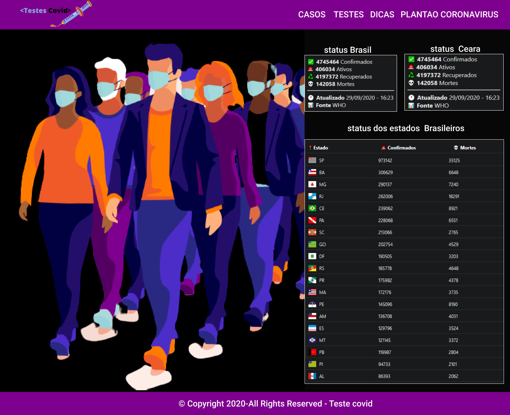

<p align="center">
</img>
</p>
<h1 align="center">Projeto teste-covid</h1>
<p align="center">O projeto foi desenvolvido para informar a população sobre os casos de covid e mostra lugares que faz os testes de covid.</p>


  ## Instalação 
Para instalar as dependências e executar o **teste-covid** você vai precisa do yarn instalado em sua máquina, o outro passo é você clona o projeto em seu computador e em seguida execute:

Clonando o projeto:

```
git clone https://github.com/Djaysson/Testes-covid.git
```

Navegando até a pasta do projeto:

```
cd Testes-covid
```

Baixando as dependências do projeto

```bash
yarn install
```

Rodando o projeto

```bash
yarn start
```


## Construido com:
* [Reactjs](https://github.com/facebook/react/blob/master/CHANGELOG.md#16131-march-19-2020)  
* [Figma](https://figma.com/) 
* [React Router](https://reactrouter.com/web/guides/quick-start) 


## API usada no projeto
Fornecer em formato JSON os dados atualizados sobre o avanço do coronavírus no Brasil.

## Docs 📄

- [Site](https://covid19-brazil-api-docs.now.sh/)

## Base url 🔌

Todas chamadas devem usar a url base:

```
https://covid19-brazil-api.now.sh
```
## Autor
**Djayson Rodrigues** - [LinkedIn](https://br.linkedin.com/in/djaysonrodrigues)


## Frontend

</img>


